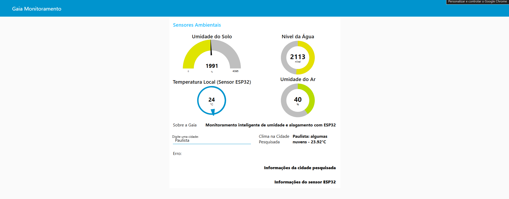
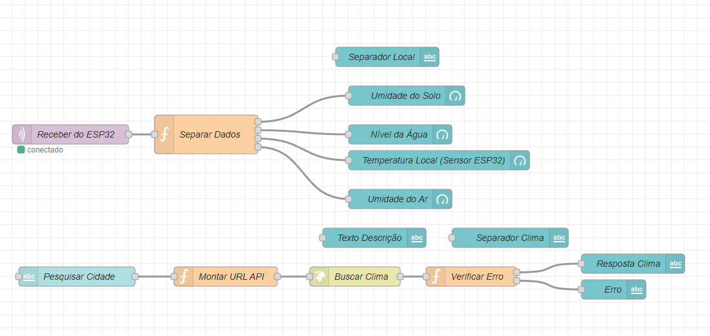

# Gaia - Monitoramento Inteligente de Umidade e Alagamento com ESP32 e Node-RED

---

## Descrição Completa da Solução

O projeto **Gaia** é uma solução integrada de monitoramento ambiental focada na prevenção de alagamentos, utilizando sensores conectados a um microcontrolador ESP32. Este dispositivo captura dados em tempo real de parâmetros ambientais essenciais, como umidade do solo, nível da água, temperatura ambiente e umidade do ar.

Esses dados são enviados via protocolo MQTT para um broker público (HiveMQ), onde o Node-RED funciona como gateway, recebendo e processando as informações. Através do dashboard do Node-RED, usuários podem visualizar os dados em tempo real através de gauges e textos explicativos.

Além disso, o sistema integra uma funcionalidade que permite a consulta do clima atual para qualquer cidade pesquisada, usando a API do OpenWeatherMap, tornando o monitoramento ainda mais completo ao juntar dados locais e meteorológicos externos.

Esta solução é ideal para áreas suscetíveis a alagamentos, ajudando na tomada de decisões preventivas e na gestão ambiental inteligente.

---

## Tecnologias e Ferramentas Utilizadas

- **ESP32:** Microcontrolador responsável por coletar os dados dos sensores ambientais.  
- **Sensores:** Medidores de umidade do solo, nível de água, temperatura e umidade do ar.  
- **MQTT (HiveMQ):** Protocolo de comunicação leve utilizado para transmissão dos dados.  
- **Node-RED:** Plataforma de desenvolvimento visual para processamento, integração e visualização dos dados.  
- **Node-RED Dashboard:** Interface gráfica que exibe os dados em tempo real com gauges, textos e inputs.  
- **API OpenWeatherMap:** Serviço para consulta de dados meteorológicos externos por cidade.

---

## Instruções para Configuração, Execução e Testes

### 1. Preparação do ESP32

Configure o ESP32 para se conectar ao broker MQTT HiveMQ com os seguintes dados:

```
Broker: broker.hivemq.com
Porta: 1883
Tópico: chuva/monitoramento
```

O ESP32 deve enviar os dados dos sensores no seguinte formato JSON:

```json
{
  "umidadeSolo": 4000,
  "nivelAgua": 3000,
  "temperatura": 25,
  "umidadeAr": 50
}
```

### 2. Configuração do Node-RED

- Instale o Node-RED seguindo as instruções oficiais:  
  https://nodered.org/docs/getting-started/

- Instale o pacote dashboard para criar interfaces gráficas:

```bash
npm install node-red-dashboard
```

- Importe o fluxo JSON deste projeto (arquivo `gaia-flow.json` ou conteúdo fornecido).

- No node de função chamado **Montar URL API**, insira sua chave da API OpenWeatherMap:

```javascript
const cidade = msg.payload;
msg.url = `https://api.openweathermap.org/data/2.5/weather?q=${cidade}&appid=SUA_CHAVE_AQUI&units=metric&lang=pt_br`;
return msg;
```

> Substitua `SUA_CHAVE_AQUI` pela chave obtida no site https://openweathermap.org/api.

- Faça o deploy do fluxo no Node-RED.

### 3. Testando a Solução

- Certifique-se que o ESP32 está conectado ao broker MQTT e publicando os dados no tópico correto.

- Abra o dashboard Node-RED (normalmente em http://localhost:1880/ui).

- Observe os gauges de umidade do solo, nível da água, temperatura e umidade do ar atualizados em tempo real.

- No campo de pesquisa, digite o nome de uma cidade para consultar o clima atual. Veja a temperatura e descrição do tempo aparecerem no dashboard.

- Teste diferentes condições para garantir que a leitura dos sensores e a consulta externa estão funcionando corretamente.

- Verifique mensagens de erro no dashboard caso a cidade digitada não seja encontrada.

---

## Detalhamento dos Fluxos Node-RED

### Fluxo MQTT para dados do ESP32

- **mqtt in:** Escuta o tópico `chuva/monitoramento` para receber mensagens JSON.

- **Função “Separar Dados”:** Separa o JSON recebido em quatro mensagens, cada uma contendo um parâmetro:
  - Umidade do solo  
  - Nível da água  
  - Temperatura  
  - Umidade do ar  

- Cada parâmetro é direcionado para um gauge específico no dashboard, que exibe o valor em tempo real.

### Fluxo de Consulta do Clima

- **ui_text_input:** Recebe o nome da cidade digitada pelo usuário.

- **Função “Montar URL API”:** Cria a URL para requisição à API do OpenWeatherMap, inserindo a cidade e a chave da API.

- **http request:** Faz a requisição GET para a API.

- **Função “Verificar Erro”:** Verifica se a resposta foi válida. Em caso negativo, envia uma mensagem de erro para o dashboard.

- **ui_text:** Exibe a temperatura e descrição do clima atual da cidade, ou a mensagem de erro.

---

## Código-Fonte e Trechos Relevantes

### Função para separar os dados do JSON

```javascript
msg1 = { payload: msg.payload.umidadeSolo };
msg2 = { payload: msg.payload.nivelAgua };
msg3 = { payload: msg.payload.temperatura };
msg4 = { payload: msg.payload.umidadeAr };
return [ [msg1], [msg2], [msg3], [msg4] ];
```

### Função para montar a URL da API do OpenWeatherMap

```javascript
const cidade = msg.payload;
msg.url = `https://api.openweathermap.org/data/2.5/weather?q=${cidade}&appid=SUA_CHAVE_AQUI&units=metric&lang=pt_br`;
return msg;
```

---

## Configuração do MQTT Broker no Node-RED

- Broker: broker.hivemq.com  
- Porta: 1883  
- Sem autenticação, sem TLS (conexão simples)

---

## Imagens Ilustrativas

### Dashboard Node-RED mostrando os gauges de sensores



---

### Fluxo Node-RED com os nós para MQTT, funções e dashboard




## Considerações Finais

Este projeto demonstra como integrar sensores IoT, protocolos de comunicação MQTT, plataformas de integração visual (Node-RED) e APIs externas para criar uma solução robusta de monitoramento ambiental.

O Gaia permite a visualização em tempo real dos dados do ambiente local e dados meteorológicos, auxiliando em ações preventivas contra alagamentos.

Sinta-se livre para expandir esta solução, adicionar alertas via email ou SMS, integrar bancos de dados e melhorar a interface.


**Gaia - Monitoramento inteligente para um mundo mais seguro.**
